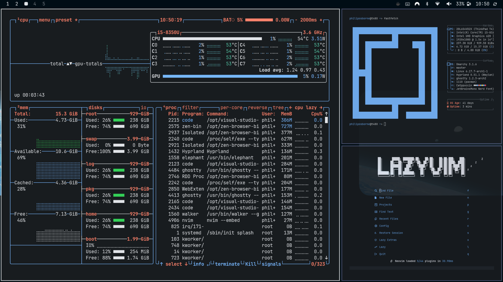
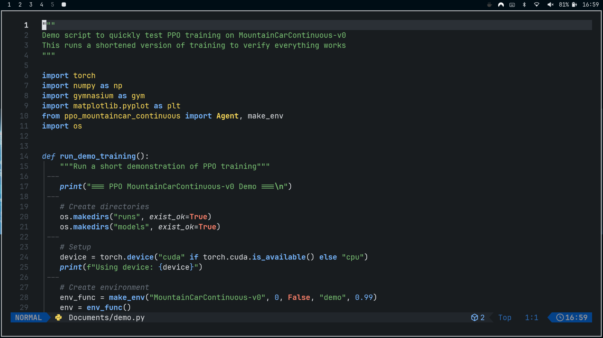
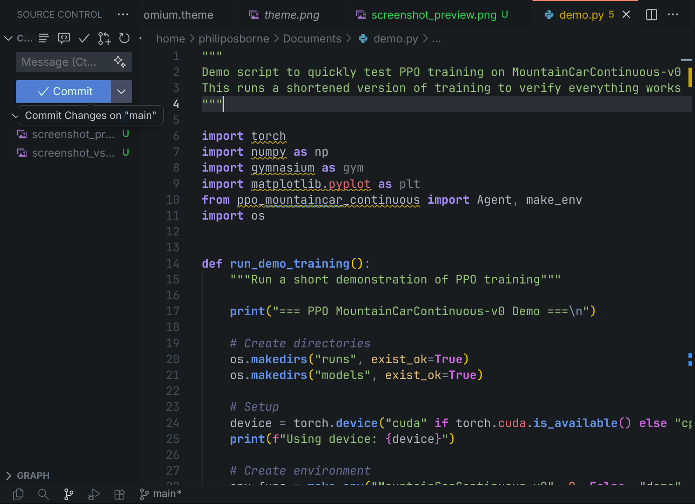
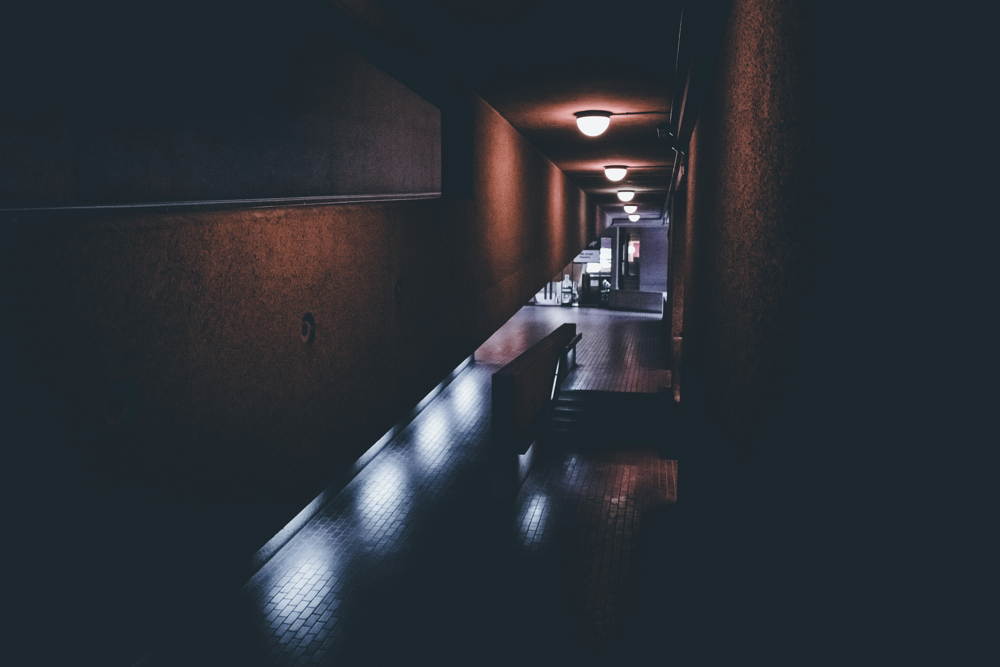
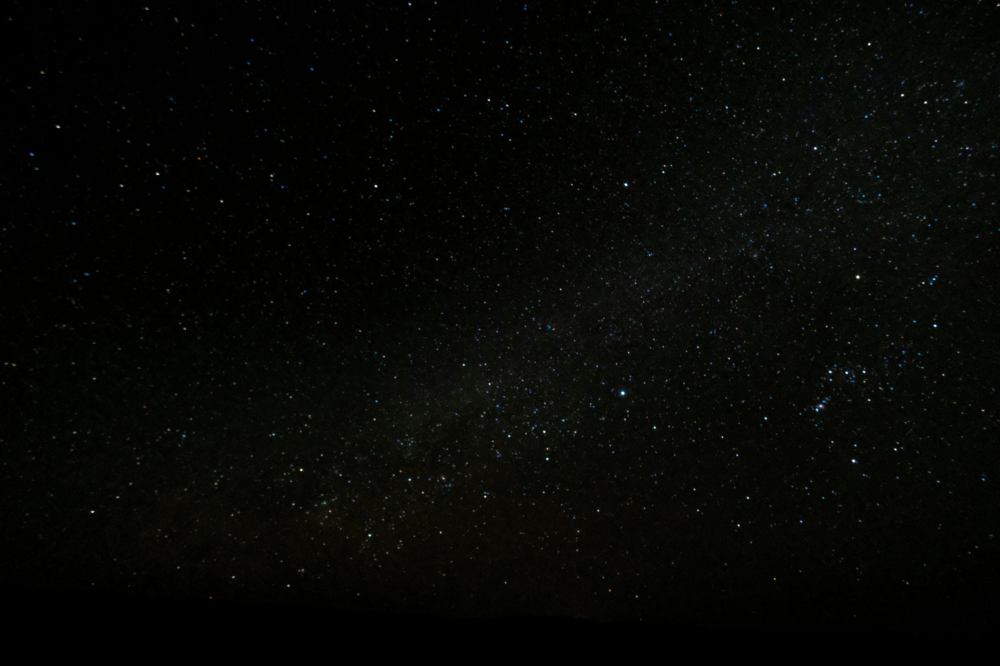

<h1>
  
  Lunar
</h1>


Lunar is a dark theme for Omarchy that prioritizes focus. It uses a simple, high contrast color palette with minimal transparency effects. Designed for those who want an easy to use theme that keeps you focused.


## Screenshots

<p align="center">
  
</p>

NVIM

<p align="center">
  
</p>

VS CODE
<p align="center">
  
</p>

## Installation

### Omarchy

To install this theme, simply use the


  1. Copy the theme repository URL 
  ```https://github.com/pdfosborne/omarchy-lunar-theme```
  2. Click SUPER + ALT + SPACE
  3. Click Install
  4. Click Style
  5. Click Theme
  6. Paste the link and hit enter to submit

or use the direct `omarchy-theme-install` command:

```bash
omarchy-theme-install https://github.com/pdfosborne/omarchy-lunar-theme
```

## Neovim Theme
See the `lunar.nvim` folder in this repository for the Neovim theme.

## VS Code Theme
A modification of the [Eva theme]() with darker background, see [Eva Plus]().

## Backgrounds

<p align="center">
  
</p>

<p align="center">
  
</p>

<p align="center">
  
</p>

<p align="center">
  
</p>